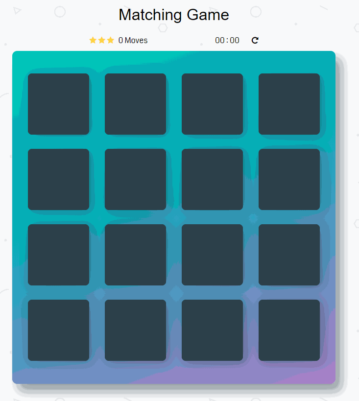
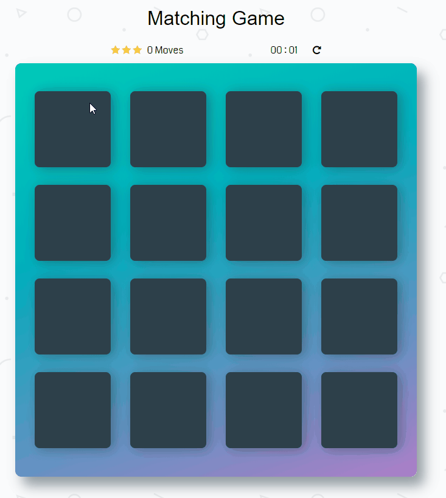
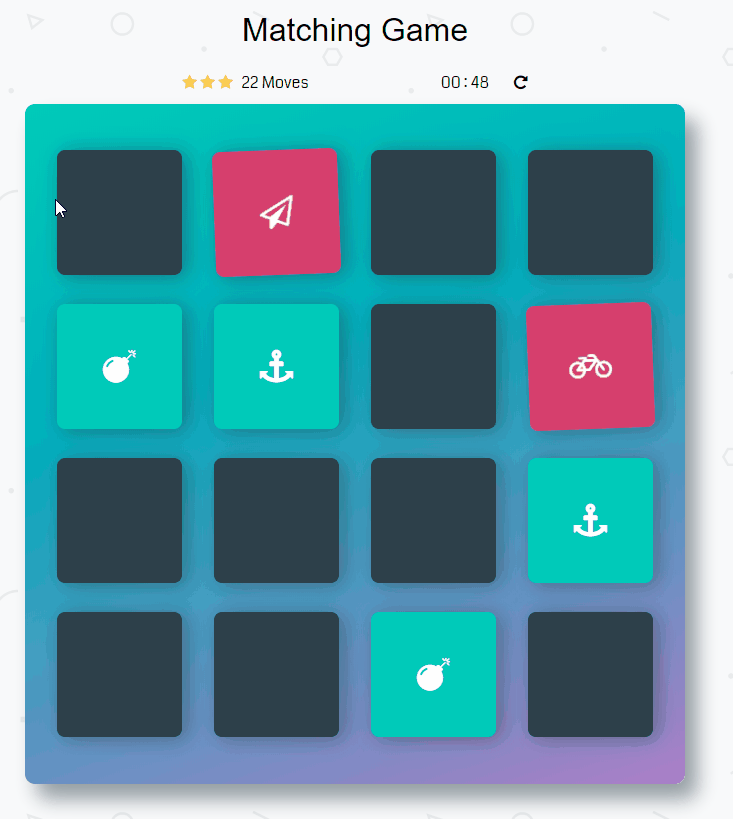
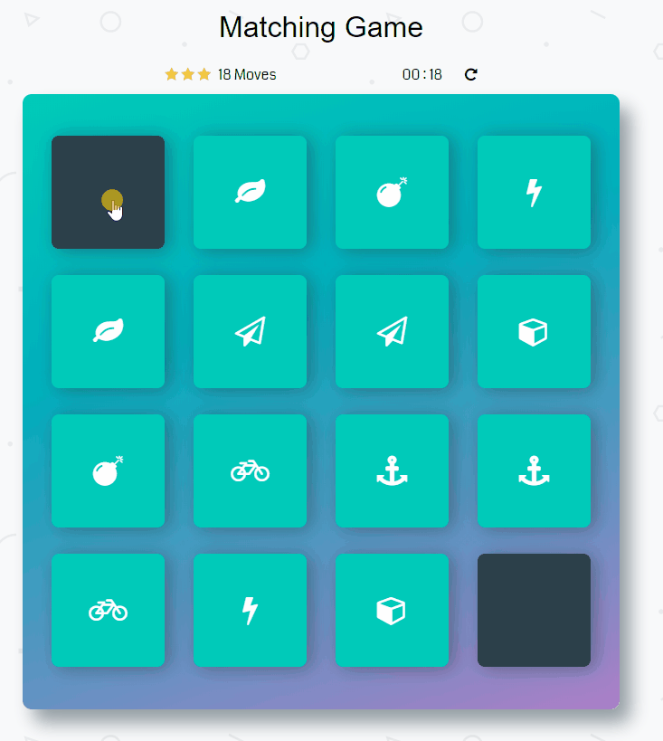

# Memory Game Project

## Table of Contents

* [General Introduction](#General-Introduction) 
* [How The Game Works](#how-the-game-works)
* [Resources](#resources)

## Genera Introduction 

This is an Udacity Front-End Developer Project, with the practice of combining skills in HTML,CSS and JavaScript into a large project. At the same time, you will learn how to design the workflow and better way to organize the JS code. 

## How The Game Works 

This is a typical match game, the deck is made up of eight different pairs of cards. In order to win the game, you need to flip the hidden cards and match them. The number of movement and Time counting will affect the final star rating. 

-> When the game is loaded, the player will have five seconds to remeber the positions of cards.

-> Once all cards are back to hidden, the time counter starts, and the player can start the game. Flipping two cards to see either they are matched or not. Also the player can restart the game whenever he likes.

-> When user's move is larger than 25 or the time is more than 2 minutes, he will lose a star. 
When user's move is larger than 40 or time is more than 4 minutes he lose one more star.

-> After all cards are matched, the user will have a modal to congratulate the player, and the player can restart the game by either play again button or the restart icon on the deck. 

## Resources 
* Shuffle function from [stackoverflow](http://stackoverflow.com/a/2450976).
* Icons from Font [fontawesome](https://fontawesome.com/v4.7.0/icons/) - [cdn](https://maxcdn.bootstrapcdn.com/font-awesome/4.6.1/css/font-awesome.min.css).